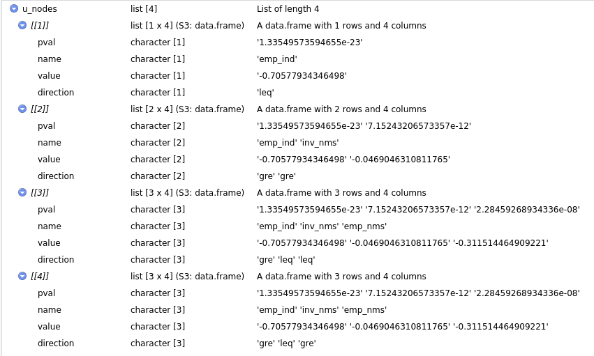
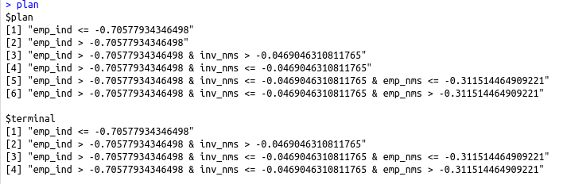
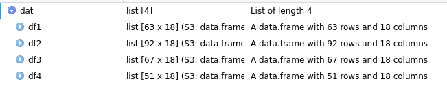

```{r include=FALSE}
# allows setting knitr code-chunk size, e.g. via size="tiny"
def.chunk.hook  <- knitr::knit_hooks$get("chunk")
knitr::knit_hooks$set(chunk = function(x, options) {
  x <- def.chunk.hook(x, options)
  ifelse(options$size != "normalsize", paste0("\\", options$size,"\n\n", x, "\n\n \\normalsize"), x)
})
require(stargazer)
require(ggplot2)
require(gridExtra)
```

```{r, include=FALSE}
load("../../data/plots_pres.Rda")
```


## Data

Recap: European Regional Database by Cambridge Econometrics

We limit the dataset to:

- timeframe 2000-2015
- no Croatia (i.e. two fewer NUTS 2 regions)

This means we get to:

- use the full set of variables
- keep a detailled London (five NUTS 2 regions)

## Motivation
```{r, echo=FALSE, fig.align='center'}
grid.arrange(plot_gdp_pc, plot_gdp_gr, ncol = 2)
```


## Results
```{r, echo=FALSE, fig.align='center'}
p_clubs_lm
```


## Results
```{r, echo=FALSE, results='asis'}
load("../../output/run.Rda")
stargazer(regs_lm, header = FALSE, font.size = "tiny", omit.stat = c("f", "rsq", "adj.rsq"),
          intercept.bottom = FALSE, title = "Regression results using unfiltered data",
          covariate.labels = c(NA, "Initial GDP p.c."), 
          dep.var.labels = "GDP p.c. growth rate 2000-15")
```


## Results
```{r, echo=FALSE, fig.align='center'}
grid.arrange(p_clubs_sar, p_clubs_sem, ncol = 2)
```


## Results
```{r, echo=FALSE, results='asis'}
stargazer(regs_sar, header = FALSE, font.size = "tiny", omit.stat = c("f", "rsq", "adj.rsq"),
          intercept.bottom = FALSE, title = "Regression results using SAR-filtered data",
          covariate.labels = c(NA, "Initial GDP p.c."), 
          dep.var.labels = "GDP p.c. growth rate 2000-15")
```


## Results
```{r, echo=FALSE, results='asis'}
stargazer(regs_sem, header = FALSE, font.size = "tiny", omit.stat = c("f", "rsq", "adj.rsq"),
          intercept.bottom = FALSE, title = "Regression results using SEM-filtered data",
          covariate.labels = c(NA, "Initial GDP p.c."), 
          dep.var.labels = "GDP p.c. growth rate 2000-15")
```


## CS excursion

**Regression vs. Iteration**
\vspace{1em}
Fibonacci sequence: $1, 1, 2, 3, 5, 8, 13, 21, ...$

Defined by $$f(n) = f(n-1) + f(n-2)$$
with the base $$f(1) = f(2) = 1$$

<!-- Remember regression trees: -->
<!-- We try to split the observations into clubs that are similar to each other -->
<!-- We do this with a recursive function akin to: -->
<!-- Explain recursion + iteration -->


## Regression tree

Split observations into branches:

```{r echo=TRUE, eval=FALSE}
tree <- function(data, split_vars, end_criteria) {
  split <- find_best_split(...)
  if (!end_criteria) {
    return(list(tree(split$data1, ...),
                tree(split$data2, ...)))
  } else { # if(end_criteria)
    return(data)
  }
}
```

<!-- Note that we supply different end criteria - minimum club size, maximum step size and insignificant splits -->
<!-- Other stuff includes how to divide up the scale (easier due to logs), but later more on the implementation -->


## Oh what a merry regression tree

<!-- Thus we divide up our dataset based on some splitting variables and receive trees like this one: -->
We receive a recursive, tree-like data structure that is:

- hard to deal with (**a lot** of helper functions are necessary)
- pretty nice

<!-- Add pretty (?) tree, dummy ahead: -->
![A partykit [@hothorn15] tree](party_tree.png){width=90%}


## Arboretum

1. Grow the tree
\vspace{1em}
\center
{width=60%}

## Arboretum

2. Fell the tree
\vspace{1em}
\center
{width=60%}

## Arboretum

```{r echo=TRUE, message=FALSE, warning=FALSE, eval=FALSE}
untree <- function(nodes, simplify = FALSE){
  out <- list()
  lumberjack <- function(nodes){ 
    # ...
    parent <- parent.frame()
    pos <- length(parent$out) + 1
    # if(...){ ...
    }else if(term_leq){
      parent$out[[pos]] <- leq
      Recall(gre)
    }
  #...} # lumberjack
  lumberjack(nodes)
  return(out)
}
```

## Arboretum

3. Plan the furniture
\vspace{1em}
\center
{width=50%}

```{r,echo=TRUE, eval=FALSE}
cumPaste <- function(vec, collapse = NULL) {
  return(sapply(vec, function(x)
    paste(vec[1:which(vec == x)], collapse = collapse)))
}
```

## Arboretum

4. Build the furniture
\vspace{1em}
\center
{width=80%}

## Computational concerns

May turn out highly branched:

- For each splitting variable
- For each value in variable

Thus we use Rcpp[@dirk]:

1. Write function in C++
```{c, eval = FALSE, echo = TRUE}
// [[Rcpp::export]]
NumericVector get_var_stat(arma::rowvec & y, 
                           mat & X, vec & Z,
                           double min_obs){ // ... }
```

2. Source in R
```{r, eval = FALSE, echo = TRUE }
Rcpp::sourceCpp("get_var_stat.cpp")
```


## Discussion

**Regression tree algorithm for convergence club identification?**

@postiglione2013using document drawbacks: 

- spatial information as nuisance
- strict jumps on boundaries
- not globally optimal
- no other controls

@andreano2017spatial

- spatial augmented convergence model (SDM), iterated spatially weighted regression algorithm

## Literature

<!-- Leave me alone -->